# reac-pw MASTER establishment FSM (code-accurate, 2026-07-28)

The state diagram of the MASTER role as `src/reac_master.c` implements it today.
This is the spec for the table-driven decision core (#61): every state, entry
action, transition trigger and deliberate ignore below is read from the code and
its cited captures, not from intent. Sibling diagrams:

- [`REAC-BOX-STATE-DIAGRAM.md`](REAC-BOX-STATE-DIAGRAM.md) — the protocol as
  captured on the wire: the BOX (slave) machine plus the master as observed from
  outside (HUNTING/GRANTING/LOCKED). This file is the inside view of that
  master: what reac-pw actually runs.
- `reac-firmware-re/REAC-CONNECTION-FSM.md` (private RE repo) — the slave-side
  connection FSM reconstruction that `src/reac_fsm.h` implements
  (FLOOD_ANNOUNCE → COLDCONNECT → TX_MUTE → ESTABLISHED). The master FSM here
  is the other half of the same courtship.

Ownership: the pacer thread owns `struct reac_master` single-threaded. Two
call sites drive it —

- `reac_master_rx()` (from `reac_pacer_rx_ingest`): one classified box frame
  per call (`reac_ctrl_classify_box_frame` produces the
  `REAC_M_RX_BOX_*` event).
- `reac_master_next()` (once per emitted downstream slot): advances the
  per-slot timers and decides the frame's control block
  (`REAC_M_EMIT_*`); the timer-driven transitions live here.

## States and entry actions

| state | meaning | entry action |
| --- | --- | --- |
| `IDLE` | pacer not emitting yet / shutdown only | (none — the `memset` init state) |
| `PROBING` | unlinked: FILLER + the cycle-locked hunt cadence (probe burst + sub01/sub02/chanmap + free-running cfea) | `enter_probing()` — `reset_control_cadence()` + regenerate the cfea with box-count 0 |
| `GRANTING` | box latched: ENROLL, the ~1.6 s recognized-but-ungranted dwell, then the generated cdea 04 03 enrollment sweep | `enter_granting(box_src, blk)` — latch `box_mac`/`join_blk`, `grant_ticks = 0`, `grant_attempts++`, rebuild the sweep from the live head-amp state, stamp the recognized width into the cfea with box-count 0 |
| `ESTABLISHED` | linked: the locked cadence (cfea + chanmap, each metronomic 1/s, nothing else) | `enter_established()` — `reset_control_cadence()`, reload the link-check budget, regenerate the cfea with box-count 1. Pacer-side, on the same transition (`note_transition`): arm the one-shot COMPLETE head-amp scene replay (`reac_headamp_tx_arm_scene`, task #179) — a real M-200 puts the whole width × 3 scene on the wire behind every grant (m200-s1608-BIDIR-reboot), and it is what restores a power-cycled box's pins |

`reset_control_cadence()` is the shared sub-action of `enter_probing` and
`enter_established`: cycle position 0, cfea tick phase-offset ~0.75 s, chanmap
cursor 0, established-chanmap tick phase-offset ~0.25 s. `enter_granting`
deliberately does NOT reset the cadence (the grant window has its own
`grant_ticks` timeline).

## State diagram

```mermaid
stateDiagram-v2
    [*] --> IDLE

    IDLE --> PROBING : first pacer slot (reac_master_next)<br/>or any box RX while IDLE (promotion)

    PROBING --> GRANTING : box JOIN cdea 04 03 with block<br/>(cold-connect; latch MAC + block)
    PROBING --> GRANTING : box CONFIG cdea 01 03 0010<br/>(warm relink — no JOIN; block NULL)

    GRANTING --> GRANTING : JOIN from a DIFFERENT box<br/>(re-latch, fresh window)
    GRANTING --> ESTABLISHED : box accept (unicast / heartbeat / config)<br/>AFTER full ENROLL+dwell+burst delivered
    GRANTING --> ESTABLISHED : tick self-complete —<br/>grant_ticks ≥ dwell + burst_len·stride + 1
    GRANTING --> PROBING : box BYE (hb selector 0x00)<br/>drop = DROP_BYE

    ESTABLISHED --> GRANTING : JOIN from a DIFFERENT box<br/>drop = DROP_MAC_CHANGE
    ESTABLISHED --> PROBING : box BYE<br/>drop = DROP_BYE
    ESTABLISHED --> PROBING : link-check budget drained<br/>(~6.5 s of box silence) drop = DROP_PEER_GONE
```

## Transition triggers, exactly

### RX-driven (`reac_master_rx`)

Every box RX first sets the presence diagnostic (`box_seen`,
`presence_tick` — never a state input), and while `ESTABLISHED` reloads the
link-check budget (every event, including one that then transitions out).
`IDLE` is promoted to `PROBING` before the event is processed ("the pacer is
ticking us if RX arrives"), and that promotion alone reports no transition to
the caller.

| state | event | guard | result |
| --- | --- | --- | --- |
| PROBING | JOIN + block | — (no MAC compare; any JOIN courts) | → GRANTING (rx returns 1) |
| PROBING | CONFIG | — | → GRANTING, block NULL (warm relink; the grant burst still fires — jumping straight to ESTABLISHED left the box blinking, rig 2026-07-12) |
| PROBING | presence flood / unicast / heartbeat / BYE / JOIN without block | — | ignore (presence alone must NEVER grant — the anti-#130 golden rule) |
| GRANTING | JOIN + block | different MAC | → GRANTING re-entry (new box, fresh window) |
| GRANTING | JOIN + block | same MAC | ignore — the box retries on its ~100 ms grid through the whole dwell; resetting would restart the dwell forever |
| GRANTING | unicast / heartbeat / config | full ENROLL+dwell+burst delivered (`grant_ticks ≥ grant_dwell + grant_burst_len·grant_stride + 1`) | → ESTABLISHED (the box's accept) |
| GRANTING | unicast / heartbeat / config | burst not yet delivered | ignore — a warm-relink box unicasts from slot 0 and would cut the burst to ~1 frame (rig 2026-07-12: GRANTING→ESTABLISHED in 0.25 ms); a heartbeat accept mid-sweep leaves a PARTIAL head-amp scene (rig 2026-07-23: "on for a second, then all mute LEDs lit") |
| GRANTING | BYE | — | → PROBING, drop = DROP_BYE |
| ESTABLISHED | BYE | — | → PROBING, drop = DROP_BYE |
| ESTABLISHED | JOIN + block | different MAC | → GRANTING, drop = DROP_MAC_CHANGE |
| ESTABLISHED | JOIN + block | same MAC | ignore — the box keeps JOINing while it settles its own TX_MUTE dwell; re-granting tore the stream down (rig 2026-07-12) |
| ESTABLISHED | unicast / heartbeat / config / presence | — | ignore (budget already reloaded) |

### Timer-driven (`reac_master_next`, once per slot)

| state | timer | result |
| --- | --- | --- |
| IDLE | first emitted slot | → PROBING (a real unlinked master ALWAYS probes; waiting for presence deadlocks against a box whose PHY never bounced, §13b) |
| GRANTING | `grant_ticks` reaches `grant_dwell + grant_burst_len·grant_stride + 1` (full ENROLL + dwell + sweep delivered) | → ESTABLISHED self-complete — the ONE forward timer, deliberately: the box goes quiet after the grant, and a master that timed back to PROBING made it re-attempt forever (rig 2026-07-12: 27 grant-timeouts, LED blinking faster). Not "granting into silence": GRANTING is only ever entered on a validated box frame, and the peer-gone budget below is the backward safety. |
| ESTABLISHED | `--link_check ≤ 0` (~6.5 s of frames, fps-scaled, reloaded by every box RX; the measured M-200i hold, 2026-07-11) | → PROBING, drop = DROP_PEER_GONE |
| PROBING | (none) | no timer path out — only a validated JOIN/CONFIG leaves |

`DROP_GRANT_TIMEOUT` is vestigial: since the self-complete replaced the grant
window expiry (rig fix 2026-07-12), no code path sets it. It stays in the enum
(and in `reac_pacer`'s logging switch) as the record of the superseded design.

### What the states EMIT (unchanged by any of this)

The cadence — probe rotation + specials, sub01/sub02, the 49-window chanmap
sweep, free-running cfea, ENROLL, the dwell's announce starvation fix, the
grant burst at 1-per-12 density, the locked 1/s cfea+chanmap pair — is
byte-pinned by `tests/test_reac_master.c`, `tests/test_reac_s1608.c`,
`tests/test_reac_conformance.c` and `tests/test_reac_courtship.c` against the
real M-200/M-300 captures. The decision core refactor moves only the
transition DECISIONS; the emit sites and their timing constants are the
goldens' territory.

While ESTABLISHED, three overlays ride FILLER slots and nothing else, and none of
them ever displaces a probe / grant / chanmap / cfea frame:

- a pending operator head-amp EDGE;
- the entry-armed COMPLETE scene replay (one record per sweep stride until the
  width × 3 scene is out — operator values where set, the enrolling defaults
  everywhere else, because a channel armed all-zero never enrols);
- the periodic RE-ASSERT of the SET cells, **built but SHIPPED DISABLED**
  (`REAC_HEADAMP_RESWEEP_SECONDS` is 0): with a cadence stated, after that much
  head-amp silence the same cursor is re-armed in set-only mode, so the cells the
  operator owns are refreshed and the cells they do not are never written. The
  cadence is measured from the last record actually emitted, so an edge or a
  scene replay pushes it out and two sweeps never overlap. A real M-200 does not
  do this — captures hold 20.8–33 s of established head-amp silence — and it
  stays off until the operator accepts that a refresh overrides a change made at
  the box's own panel, and the capture gate has run. Both, and the openmixer
  scene watch that holds the job meanwhile, are in
  [HEADAMP-REASSERT-POLICY.md](HEADAMP-REASSERT-POLICY.md).

## The law of this file

Every state, entry action, transition and deliberate ignore lives HERE, and
reconnection behaviour attaches to the diagram — an entry action or a
transition-observer action on an EXISTING transition — never as a new state or
timer invented at a call site. The head-amp scene replay (2026-08-19) is the
worked example: a box that power-cycles simply re-courts, so the restore is the
GRANTING→ESTABLISHED entry's business, not a new "RECOVERING" state. One known
caveat lives console-side by design: a freshly-BOOTED box ignores head-amp
records while its input board initialises, so the console's scene watch re-applies
its recorded scene again after a settle window (openmixer `server.ts`,
`REAC_SCENE_SETTLE_REPLAY_MS`) — deliberately not a reac-pw state, because the
wire protocol has no readback to hang a state on.

## Decision-core mapping (#61) — LANDED

`src/reac_master_fsm.{h,c}` is that table, and `reac_master.c` routes every
transition through it (3436a7d, 0a09d32, both 2026-07-28 — this document was
written from the pre-table code two commits earlier, which is why the section
below reads as a plan). The guards above are classified INTO the event, so the
step function is a pure `(state, event) → (next state, entry action, drop reason)`
mapping (the shape `src/reac_fsm.h` already gave the slave side):

- rx kinds fold to: `PRESENCE` (bcast filler, JOIN without block),
  `JOIN_NEW` / `JOIN_SAME` (MAC compare against the latched box),
  `CONFIG` / `CONFIG_EARLY` and `ACCEPT` / `ACCEPT_EARLY` (unicast+heartbeat)
  split on the grant-delivered predicate, `BYE`;
- timers fold to: `START` (first slot / RX-while-IDLE promotion),
  `GRANT_DELIVERED` (self-complete), `LINK_LOST` (budget drained).

Ignores are table rows too — every `(state, event)` pair is asserted by the
decision-core unit test, so a silent fall-through can never reappear as an
accidental transition.
